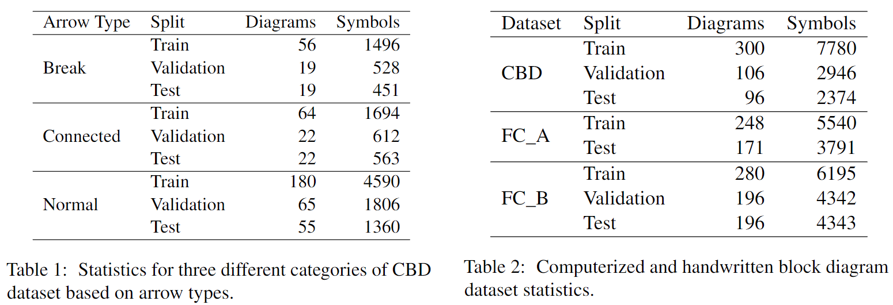

# Block-Diagram-Datasets

This repository contains all the datasets used in the paper:  
**_Block Diagram-to-Text: Understanding Block Diagram Images by Generating Natural Language Descriptors_**

The goal of this paper is to automatically generate summaries from a block diagram image by extracting the contextual information and relationship between different shapes or nodes.

## About Dataset

Computerized block diagrams (CBD) dataset consist of three different categories: 
i) Break arrow that has some gap in between an arrow, 
ii) Connected arrows where two or more arrows are interlinked together,
iii) Normal arrow which includes both thin and thick types of arrows. 

There are total 7 classes: Connection for circle, Data for parallelogram, Decision for diamond, Terminator for eclipse, Arrow, Text, and Process for all other shapes not mentioned above. Table below shows some of the statistics of all the datasets. For more information about the datasets, please go through the paper.

Images in the computerized block diagrams (CBD) dataset are collected through web crawling from different search engines such as Google, Yahoo, Bing, and Naver that are publicly available up to our knowledge. In addition, we manually replace around 50% of the text from each diagram with some different meaningful texts. Replacing texts also help with data privacy issue and protect personal and sensitive information.

*Note: This dataset is made available for academic research purpose only. If any of the images belongs to you and you would like it removed, please kindly inform [us](mailto:shreyanshubhushan@gmail.com), we will remove it from our dataset immediately.*

## References

We extend the Handwritten diagram datasets used in the following papers by adding triplets and summaries for each diagram:
- Schäfer, Keuper & Stuckenschmidt (2021). [Arrow R-CNN for handwritten diagram recognition](https://link.springer.com/article/10.1007/s10032-020-00361-1) (IJDAR)
- Schäfer, Stuckenschmidt (2021). [DiagramNet: Hand-drawn Diagram Recognition using Visual Arrow-relation Detection](https://link.springer.com/chapter/10.1007/978-3-030-86549-8_39) (ICDAR)

If you use the Handwritten diagram datasets, also make sure to cite the dataset author papers.

## Licenses

Datasets:
- FC\_A (aka [OHFCD](http://tc11.cvc.uab.es/datasets/OHFCD_1)): licensed under [CC-BY-NC-SA](https://creativecommons.org/licenses/by-nc-sa/3.0/), as mentioned on the linked TC11 website
- [FC\_B](https://cmp.felk.cvut.cz/~breslmar/flowcharts/): this dataset do not have a license

## Contact

For any questions or suggestions you can use the issues section or reach us at shreyanshubhushan@gmail.com.
